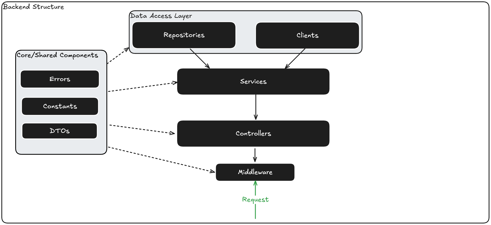

# General Structure of the API/Backend

The primary components to be aware of in the backend are:

- **Controllers**
- **Services**
- **Clients**
- **Repositories**

There are also other components that play a less pivotal role but still form part of the project, such as:

- **Constants**
- **DTOs**
- **Middleware**
- **Errors**

## Controllers

The controllers are the entry point to the API from a consumer perspective. This is where endpoints are declared and exposed to the consumer.

They are primarily responsible for routing and should be as simple as possible. They call the relevant services to handle business logic, data retrieval, etc.

An example of a controller is shown below:

```csharp
using Lyzer.Common.DTO;
using Lyzer.Services;
using Microsoft.AspNetCore.Mvc;
using System.Text.Json;

namespace Lyzer.Controllers
{
    [ApiController]
    [Route("/api/v1/drivers")]
    public class DriverController : ControllerBase
    {
        private readonly ILogger<DriverController> _logger;
        private readonly DriverService _driverService;

        public DriverController(ILogger<DriverController> logger, DriverService driverService)
        {
            _logger = logger;
            _driverService = driverService;
        }

        [HttpGet("standings", Name = "Get driver standings")]
        public async Task<ActionResult<DriverStandingsDTO>> GetCurrentDriverStandings()
        {
            return await _driverService.GetCurrentDriverStandings();
        }
    }
}
```

## Services

The services are likely the more complex and sophisticated pieces of the codebase, as this is where the heavy lifting occurs.

Services are responsible for handling all business logic, transformation, and calling the relevant data retrieval methods/functionality.

An example of a service is shown below:

```csharp
using Lyzer.Clients;
using Lyzer.Common.Constants;
using Lyzer.Common.DTO;
using Newtonsoft.Json;

namespace Lyzer.Services
{
    public class DriverService
    {
        private readonly ILogger<DriverService> _logger;
        private readonly JolpicaClient _client;
        private readonly CacheService _cache;

        public DriverService(ILogger<DriverService> logger, JolpicaClient client, CacheService cache)
        {
            _logger = logger;
            _client = client;
            _cache = cache;
        }

        public async Task<DriverStandingsDTO> GetCurrentDriverStandings()
        {
            string key = String.Format(CacheKeyConstants.DriverStandings, "current");
            string? result = await _cache.Get(key);

            if (result == null)
            {
                DriverStandingsDTO standings = await _client.GetCurrentDriverStandings();
                await _cache.Add(key, JsonConvert.SerializeObject(standings), TimeSpan.FromHours(1));
                return standings;
            }

            return JsonConvert.DeserializeObject<DriverStandingsDTO>(result) ?? new DriverStandingsDTO();
        }
    }
}
```

## Clients

Clients are responsible for communicating with other APIs. In the case of Lyzer, an example is a client to query Jolpica F1 data.

Clients should perform minimal work, keeping everything as simple as possible, and focus primarily on communication with APIs. They should *not* perform transformations or similar tasks.

An example implementation is shown below:

```csharp
using System.Runtime.Serialization;
using System.Text.Json;
using Newtonsoft.Json;
using RestSharp;
using Lyzer.Common.Constants;
using Lyzer.Common.DTO;
using Lyzer.Errors;

namespace Lyzer.Clients
{
    public class JolpicaClient
    {
        private readonly ILogger<JolpicaClient> _logger;
        private readonly RestClient _client;

        public JolpicaClient(ILogger<JolpicaClient> logger)
        {
            RestClientOptions options = new RestClientOptions(URIConstants.Jolpica.BaseUri);
            _client = new RestClient(options);
            _logger = logger;
        }

        public async Task<DriverStandingsDTO> GetCurrentDriverStandings()
        {
            string requestPath = String.Format(URIConstants.Jolpica.DriverStandingsUri, "current");
            JsonDocument? result = await _client.GetAsync<JsonDocument>(requestPath);

            if (result == null)
            {
                throw new Exception404NotFound("Could not retrieve data at: " + requestPath);
            }

            JsonElement root = result.RootElement;

            JsonElement standings = root
                .GetProperty("MRData")
                .GetProperty("StandingsTable")
                .GetProperty("StandingsLists")[0];

            DriverStandingsDTO? driverStandings = JsonConvert.DeserializeObject<DriverStandingsDTO>(standings.GetRawText());

            if (driverStandings == null)
            {
                throw new SerializationException("Could not deserialize driver standings.");
            }

            return driverStandings;
        }
    }
}
```

## Repositories

Repositories are responsible for communicating with data storage such as a database (e.g., PostgreSQL). Currently, the project does not contain any repositories, but they will likely be needed in the future.

Please note that repositories are similar to clients in that business logic and transformation should be kept to a minimum and generally avoided in these classes.

## Constants

We use classes with constants for values that are frequently used. If we make changes to these values, they should reflect across the entire codebase.

This is easy to manage with constants, as all values using the variable will be updated.

An example is shown below:

```csharp
namespace Lyzer.Common.Constants
{
    public static class URIConstants
    {
        public static class Jolpica
        {
            public static string BaseUri { get; set; } = "https://api.jolpi.ca/ergast/f1";
            public static string DriverStandingsUri { get; set; } = "/{0}/driverstandings";
        }
    }
}
```

## DTOs

You might be familiar with schemas, models, or other terms for these. In this codebase, they are referred to as DTOs (Data Transfer Objects).

These objects represent what the API will return on successful calls.

An example is shown below:

```csharp
namespace Lyzer.Common.DTO
{
    public class DriverDTO
    {
        public string DriverId { get; set; }
        public string PermanentNumber { get; set; }
        public string Code { get; set; }
        public string Url { get; set; }
        public string GivenName { get; set; }
        public string FamilyName { get; set; }
        public DateTime DateOfBirth { get; set; }
        public string Nationality { get; set; }
    }
}
```

## Middleware

Middleware components are used to handle cross-cutting concerns such as logging, authentication, and error handling. They are executed in the order they are registered in the application pipeline.

Currently we only use this for error handling.

An example is shown below:

```csharp
using Lyzer.Errors;
using Newtonsoft.Json;

namespace Lyzer.Middleware
{
    public class ExceptionHandlingMiddleware
    {
        private readonly RequestDelegate _next;
        private readonly ILogger<ExceptionHandlingMiddleware> _logger;

        public ExceptionHandlingMiddleware(RequestDelegate next, ILogger<ExceptionHandlingMiddleware> logger)
        {
            _next = next;
            _logger = logger;
        }

        public async Task Invoke(HttpContext context)
        {
            try
            {
                await _next(context);
            }
            catch (Exception404NotFound ex)
            {
                _logger.LogError(ex, "404 exception occurred.");
                await HandleExceptionAsync(context, StatusCodes.Status404NotFound, "Not found.", ex);
            }
            catch (Exception ex)
            {
                _logger.LogError(ex, "An unhandled exception occurred.");
                await HandleExceptionAsync(context, StatusCodes.Status500InternalServerError, "An unexpected error occurred.", ex);
            }
        }

        private static Task HandleExceptionAsync(HttpContext context, int statusCode, string message, Exception exception)
        {
            context.Response.ContentType = "application/json";
            context.Response.StatusCode = statusCode;

            var errorResponse = new
            {
                Message = message,
                Details = exception.Message
            };

            return context.Response.WriteAsync(JsonConvert.SerializeObject(errorResponse));
        }
    }
}
```

Middleware components are registered in the `Program.cs` file. For example:

```csharp
var app = builder.Build();

app.UseSwagger();
app.UseSwaggerUI();
app.UseHttpsRedirection();
app.UseAuthorization();
app.MapControllers();

app.UseMiddleware<ExceptionHandlingMiddleware>();
```

## Errors

Error handling is a crucial part of any application. In Lyzer, we handle errors using custom exceptions and middleware to ensure consistent and meaningful error responses.

The middleware aspect of this was covered above, below you can find an example of a custom exception.

```csharp
namespace Lyzer.Errors
{
    public class Exception404NotFound : Exception
    {
        public Exception404NotFound(string message) : base(message) { }
    }
}
```

## Diagram


