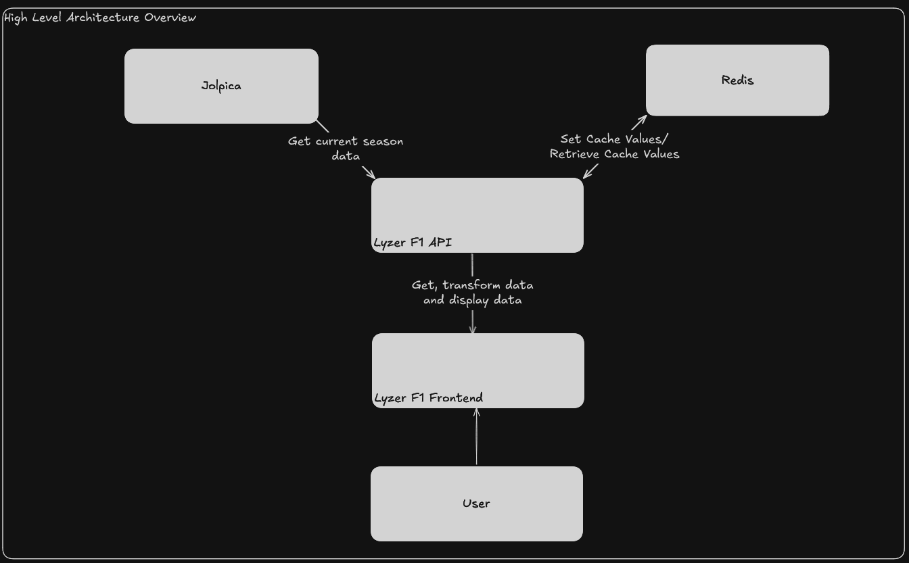

# High-Level Architecture Overview

**Note:** This project is under active development, so the architecture is subject to change.

## Components

- **Jolpica F1 API**
- **Redis**
- **Lyzer API**
    - C#
    - ASP.NET

### Jolpica F1 API

The Jolpica F1 API, a successor to the Ergast F1 API, can be found [here](https://api.jolpi.ca/ergast/f1). This is currently the primary data source for all F1 data provided by Lyzer.

### Redis

We use Redis to cache data for the current year instead of storing it in a more permanent location, as this data is subject to change. Examples of cached data include:

- Driver Standings
- Constructor Standings
- Races for the season

### Lyzer API

The Lyzer API is a C#, ASP.NET powered backend. Its main roles are:

- Providing Formula 1 data for the current year such as:
    - Driver Standings
    - Constructor Standings
    - Races
    - Results

## Diagram

