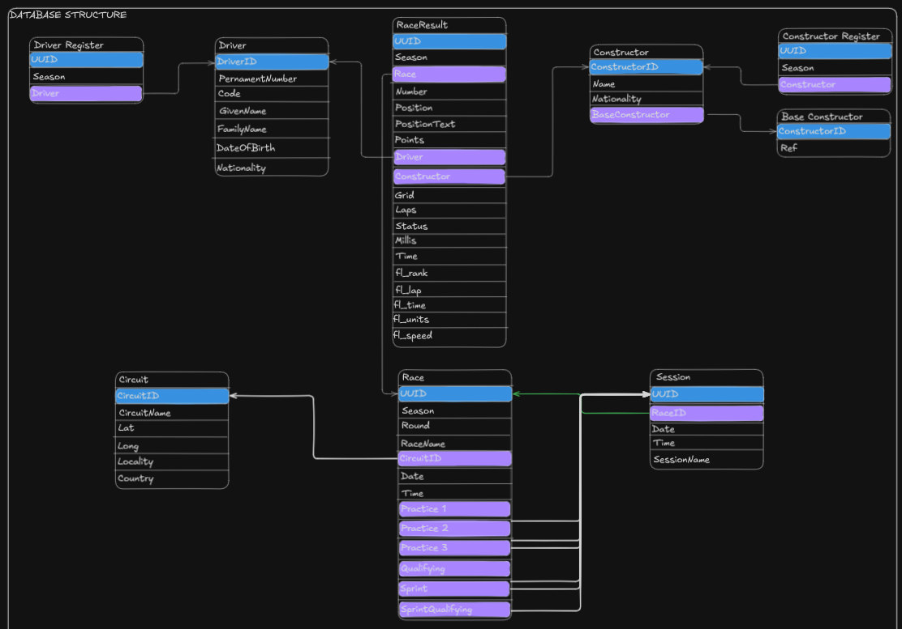

# Lyzer ETL

- Author: [Evanlab02](https://github.com/Evanlab02)
- Email: [evanlab02@gmail.com](mailto:evanlab02@gmail.com)
- Date: 2025-03-14
- Status: Review
- Planned: No
- Milestone: Not planned

## Summary

Since the inception of Lyzer, there has always been a consideration to add an ETL process and we are now at a point where we can start to plan this.

The ETL process will be used to extract historical F1 data from Jolpica and store that in our database. We could also use it for current data where expensive computations are required.

This will reduce the load on our API and Jolpica and make the system more efficient.

## Motivation

**What does it solve:**

- Removes the reliance on only a cache for F1 data and instead store it in a more durable and scalable way.
- Allows us to compute metrics and store the calculations for use later on, reducing overhead on the API,
- Also allowing us to use a more durable store for data from previous seasons like driver standings, results etc. Things that will not change. Significantly reducing the amount of load we create for Jolpica.
- Provides a historical data store for analytics.

**Who benefits:**

- The users of the API will see faster response times and a more reliable service.
- We will see a reduction in the load on Jolpica (and giving them less to worry about) allowing us to also use our rate limit more efficiently for when we need it.

## Detailed Description

### Technical Details

#### Stack

We will use python to create the ETL process due to its ease of use and modularity.

We will combine this with:

- `typer` to create a CLI for the ETL process.
- `fastapi` available to expose a REST API for the ETL process.

This will allow us to have a flexible and scalable ETL process that can be used in a variety of ways, lets explore some of the ways this is useful

- Great local development experience, we can just run the CLI to quickly populate our local database for development for whatever functionality we are testing.
- The CLI allows us to have an easy fallback to manually populate the production database if needed.
- The REST API will allow us to have a flexible way to populate the database for whatever data we need and make it easy to access from anywhere removing the need to have a local CLI always available.

Some other dependencies that could likely be used:

- `SQLModel`
- `pydantic`

Typer, FastAPI and SQLModel are all developed by [@tiangolo](https://github.com/tiangolo) and are all published under FastAPI's organization and have impressive compatibility with each other.

Pydantic is the a standard for many frameworks for APIs and therefore is great addition, also FastAPI is built with Pydantic as a core dependency.

We will likely need to use something like `alembic` to create migrations for the database.

#### Structuring

Important to note here is that this will take a careful structuring in the source code to ensure that we can easily use functionality from the codebase in the CLI and API. This just means that things like typer and fastapi will be used to wrap the functionality of the codebase and is simply just exposing the functionality of the codebase to the CLI and API which is anyways a good design principle.

#### Database Design

**NOTE: There is one thing that was missed here and that is that we will likely store Qualifying, Sprint and Sprint Qualifying data in a seperate table than the session table. This way we can continue the result table trend and create new tables that link to sprint/sprint qualifying/qualifying session tables. Session tables can probably be more accurately named as practice session table.**

### Implementation approach

Here is a very rough draft implementation plan:

1. Create a very basic `hello world` application using typer and fastapi to get a good initial structure in place.
2. Create commands/endpoints for the following (NOTE that some of these steps could likely be broken down further as there will be multiple tables that can be created from the data):
    - Fetching and storing races data.
    - Fetching and storing constructor data.
    - Fetching and storing driver data.
    - Fetching and storing results data.
3. Allow for different configurations to be saved to the device (to allow easy switching between local/production)
4. Consume the DB that this ETL process creates from the official Lyzer API.

Continue using ETL process to create new features and data that we want to store in the DB.
